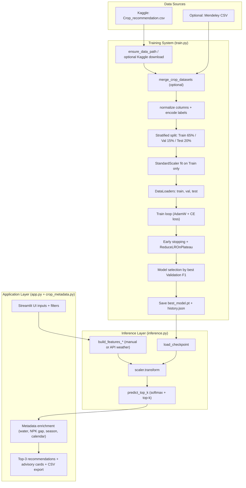
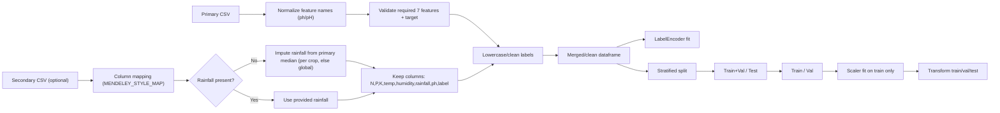
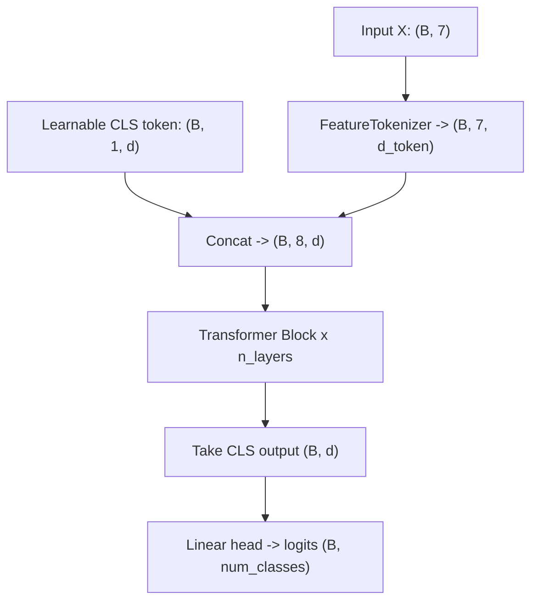
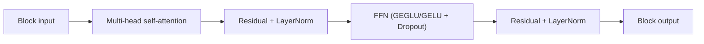
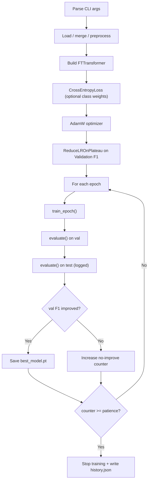
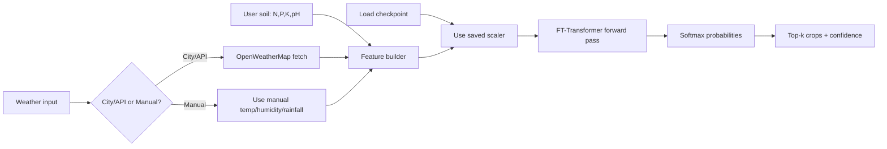
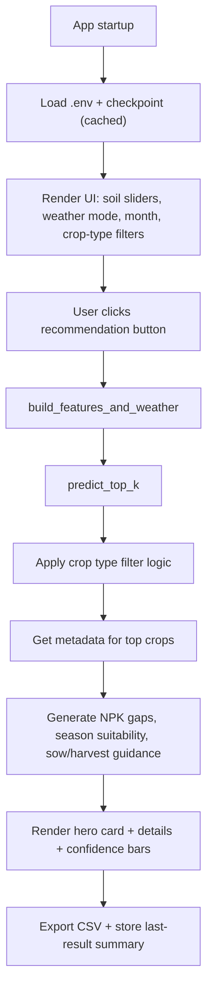
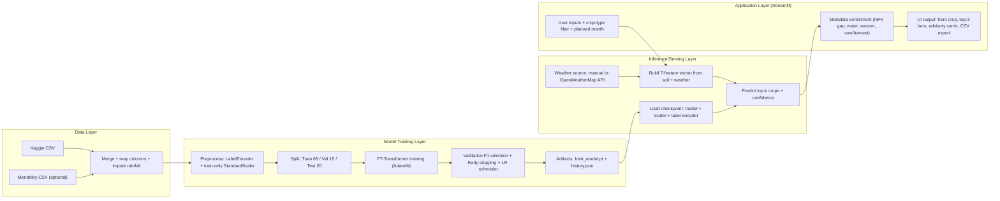

# Crop Recommendation Project - Updated Architecture

This is the refreshed architecture for your current codebase. It covers data ingestion, optional dataset merge, FT-Transformer training with validation-driven model selection, checkpointing, inference, and Streamlit app presentation.

---

## 1) End-to-end architecture



---

## 2) Data pipeline and merge logic



**Current behavior in code:**
- Primary data can auto-download from Kaggle if not found.
- Secondary dataset is optional via `--merge_secondary`.
- Final feature order is fixed: `N, P, K, temperature, humidity, rainfall, ph`.
- Split is stratified and leakage-safe (scaler fitted only on training subset).

---

## 3) FT-Transformer internals (`model.py`)





**Why this fits your task:**
- Each numerical feature is treated as a token, so attention can learn feature interactions (e.g., nutrient-weather coupling).
- CLS token acts as a global summary for classification.

---

## 4) Training control flow (`train.py`)



**Artifacts produced:**
- `checkpoints/best_model.pt`
  - `model_state_dict`
  - `scaler`
  - `label_encoder`
  - `num_classes`
  - `feature_columns`
- `checkpoints/history.json`
  - per-epoch metrics for `train`, `val`, `test`

---

## 5) Inference and weather integration (`inference.py`)



**Inference contract:**
- Input shape to model is always `(1, 7)` in fixed feature order.
- Same scaler from training checkpoint is always used.
- Output is ranked crop recommendations with probabilities.

---

## 6) Streamlit app flow (`app.py`)



**UI enrichment sources:**
- `crop_metadata.py` provides crop type, water requirement, duration, sow/harvest months, ideal NPK ranges, water source, and suitable seasons.

---

## 7) File-to-component map

| File | Responsibility |
|---|---|
| `train.py` | Data loading, optional merge, preprocessing, split, training loop, checkpoint/history save |
| `model.py` | FT-Transformer model (FeatureTokenizer, TransformerBlock, GEGLU, classifier head) |
| `inference.py` | Checkpoint loading, weather API fetch, feature building, top-k prediction |
| `app.py` | Streamlit UI, input collection, model invocation, result rendering/export |
| `crop_metadata.py` | Static agronomy metadata + helper utilities (season, NPK gaps, month labels) |
| `.env` / `.env.example` | API credentials and local environment configuration |
| `data/*.csv` | Primary/secondary/merged datasets |
| `checkpoints/*` | Model checkpoints and training history |

---

## 8) Deployment/runtime view

```text
Developer/CLI path:
  python train.py [--merge_secondary ...] -> checkpoints/best_model.pt
  python inference.py -> terminal recommendations

End-user path:
  streamlit run app.py -> browser UI -> checkpoint inference -> advisory output
```

---

## 9) Notes on correctness and maintainability

- Validation-driven checkpointing avoids selecting model by test performance.
- Scaler fit on train-only prevents leakage.
- Checkpoint schema is stable for app/inference compatibility.
- Data merge is resilient to alternate column names and missing rainfall.

You can render these Mermaid diagrams in Cursor, GitHub, or [mermaid.live](https://mermaid.live).

---

## 10) One-page compact architecture (presentation view)



This compact diagram is the high-level "single slide" version. Use Sections 1-9 for full technical detail.
